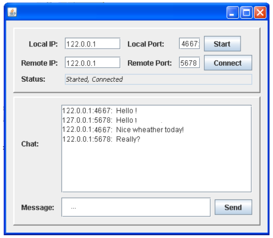
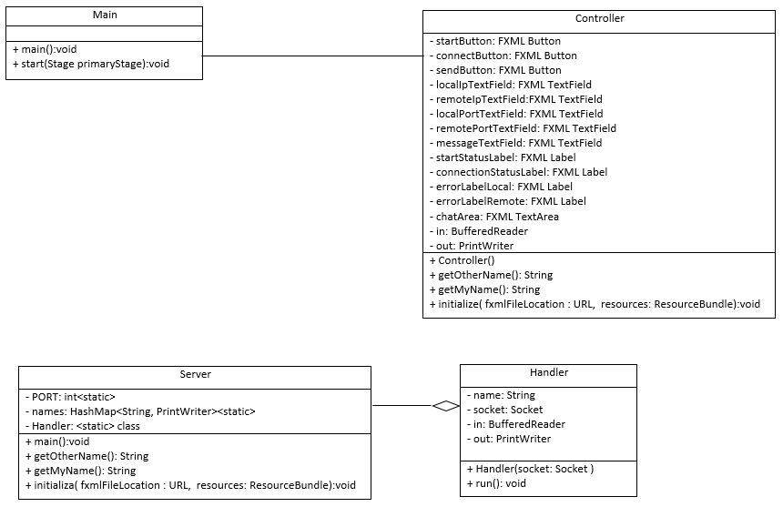

# Conference-System
Creating a peer-to-peer network to communicate with other users 

##
Sockets, streams, thread, error handling, object orienting and GUI in Java are implemented.
Multi-user system consists of participants themselves. A user’s application is able to communicate with other user’s applications. All user’s applications must therefore be linked to each other directly or indirectly, and thus a peer-to-peer (P2P) network is created. The program consists of a standalone application, which acts as both server and client. The user interface should look like the image below:

## Operation and Functionality
1. After starting the application, the user must enter the local IP address and the local port. The application will listen to clients as a server (mediator). Pressing the Start button begins listening on the local port.
2. The user enters an IP address and port to another application (which is running and listening). Upon pressing the Connect button, a connection will be created between the local and the Remote application.
3. In the Status box, the whole time status for updated if the application is properly connected to any other application.
4. Once the application has started listening and connected to another application, the whole time chat box is updated with messages sent by any application in the entire P2P network.
5. To send a private message to the P2P network, you enter its message in the Message box and press the Send button.

